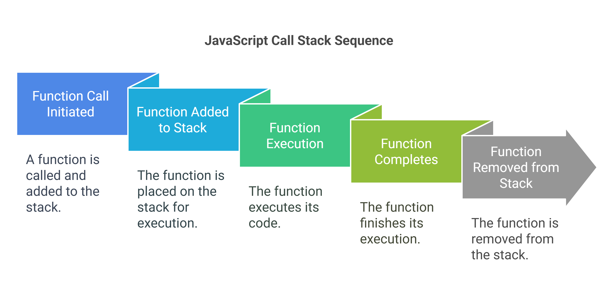

# **Complete JavaScript Learning Guide** 🚀  
A structured, beginner-to-advanced JavaScript guide covering all key concepts, operators, functions, objects, arrays, scope, closures, and more.

---
> # **JavaScript Basics**

[1. Call Stack](#1️⃣-call-stack) 

[2. Primitive Types](#2️⃣-primitive-types)

[3. Value Types vs Reference Types](#3️⃣-value-types-vs-reference-types)

[4. JavaScript Operators](#4️⃣-javascript-operators)

[5. JavaScript Functions](#5️⃣-javascript-functions)

[6. JavaScript Objects](#6️⃣-javascript-objects)

[7. JavaScript Arrays](#7️⃣-javascript-arrays)

[8. JavaScript Scope](#8️⃣-javascript-scope)

[9. JavaScript Closures](#9️⃣-javascript-closures)

[10. JavaScript Conditions and Loops](#10-js-conditions-and-loops)
## **📌 Phase 1: JavaScript Basics**

### **1️⃣ Call Stack**  
The **call stack** is a mechanism JavaScript uses to manage function execution, following the **LIFO (Last In, First Out)** principle.  




#### **Example:**
```javascript
function first() {
    console.log("First function");
    second();
}
function second() {
    console.log("Second function");
    third();
}
function third() {
    console.log("Third function");
}
first();
```

## Explanation of this program & call stack:

1. **first() is called**  
   - first() is called, so its execution context is added to the stack.  
   - **Call Stack at this moment:**  
     |first()|  
   - `"First function"` is printed.

2. **second() is called**  
   - second() is called from inside first(), so its execution context is added to the stack.  
   - **Call Stack at this moment:**  
     |first()| second()|  
   - `"Second function"` is printed.

3. **third() is called**  
   - third() is called from inside second(), so its execution context is added to the stack.  
   - **Call Stack at this moment:**  
     |first()| second()| third()|  
   - `"Third function"` is printed.

4. **Pop Execution Contexts (LIFO Principle)**  
   - The stack follows the Last In, First Out (LIFO) principle, so the functions are popped off in the reverse order they were called.  
     - **third()** completes and is removed from the stack.  
     -  **second()** completes and is removed from the stack.  
     - Finally, **first()** completes and is removed from the stack.  
   - **Call Stack after all functions are completed:**  
     |empty|


### Key Points:
- Each function call **pushes** its execution context onto the call stack.
- **first()** is added to the stack first, so it starts executing first.

- the function execute immediately after the function is added to the stack.
- Functions are **popped** from the stack immediately after they finish executing.


---

### **2️⃣ [Primitive Types](./primitive_type/README.md)**  
JavaScript has **seven primitive data types**, which are **immutable (unchangeable)**:  

- `Number` – Numeric values (`let x = 10;`)
- `String` – Text values (`let name = "John";`)
- `Boolean` – True or false (`let isValid = true;`)
- `Null` – Empty or unknown value (`let value = null;`)
- `Undefined` – A variable declared but not assigned (`let x;`)
- `Symbol` – Unique identifiers (`let id = Symbol("id");`)
- `BigInt` – Large integers (`let bigNumber = 12345678901234567890n;`)

---

### **3️⃣ Value Types vs Reference Types**  
JavaScript stores data in two ways:  

✔ **Value Types (Primitive Data)**: Stored **directly in memory**.  
✔ **Reference Types (Objects, Arrays, Functions)**: Stored **by reference** in memory.  

#### **Example:**
```javascript
let a = 10;
let b = a;  // Copying the value (primitive type)
b = 20;
console.log(a); // 10 (original value remains unchanged)
```
```javascript
let obj1 = { name: "Alice" };
let obj2 = obj1;  // Reference to the same object
obj2.name = "Bob";
console.log(obj1.name); // "Bob" (changes reflect in both)
```

---

### **4️⃣ JavaScript Operators**  
Operators allow us to perform calculations, comparisons, and logical operations.

#### **Types of JavaScript Operators:**

1️⃣ **Arithmetic Operators** – Perform math calculations.  
   ```javascript
   let sum = 10 + 5;  // Addition (+)
   let power = 2 ** 3; // Exponentiation (**)
   ```

2️⃣ **Assignment Operators** – Assign values.  
   ```javascript
   let x = 5;
   x += 3;  // Same as x = x + 3;
   ```

3️⃣ **Comparison Operators** – Compare values.  
   ```javascript
   console.log(5 == "5");   // true (loose equality)
   console.log(5 === "5");  // false (strict equality)
   ```

4️⃣ **Logical Operators** – Combine conditions.  
   ```javascript
   console.log(true && false); // false (AND)
   console.log(true || false); // true (OR)
   ```

5️⃣ **Bitwise Operators** – Work at the binary level.  
   ```javascript
   let bitwiseAnd = 5 & 1; // AND operation
   ```

6️⃣ **Ternary Operator** – Shorter `if-else`.  
   ```javascript
   let age = 20;
   let status = age >= 18 ? "Adult" : "Minor";
   ```

---

### **5️⃣ JavaScript Functions**  
Functions help break code into reusable blocks.

#### **Types of Functions:**
- **Function Declaration**  
   ```javascript
   function greet(name) {
       return "Hello, " + name + "!";
   }
   ```
- **Function Expression**  
   ```javascript
   const greet = function(name) {
       return "Hello, " + name + "!";
   };
   ```
- **Arrow Function**  
   ```javascript
   const greet = (name) => "Hello, " + name + "!";
   ```
- **IIFE (Immediately Invoked Function Expression)**  
   ```javascript
   (function() {
       console.log("I am an IIFE");
   })();
   ```
- **Generator Function**  
   ```javascript
   function* generatorFunction() {
       yield 1;
       yield 2;
       yield 3;
   }
   ```

---

### **6️⃣ JavaScript Objects**  
Objects store data in **key-value** pairs.

#### **Creating an Object:**
```javascript
const person = {
    name: "John",
    age: 30,
    greet: function() {
        return "Hello, " + this.name;
    }
};
```

---
### **7️⃣ JavaScript Arrays**  

Arrays in JavaScript are special objects used to store multiple values in a single variable. They allow efficient data manipulation and are widely used in JavaScript programming.

#### Creating an Array

#### 1. **Using Array Literal**
```javascript
const fruits = ["Apple", "Banana", "Cherry"];
```

#### 2. **Using the `new Array()` Constructor**
```javascript
const fruits = new Array("Apple", "Banana", "Cherry");
```

#### Accessing Array Elements
```javascript
console.log(fruits[0]); // "Apple"
console.log(fruits[1]); // "Banana"
```

#### Modifying Array Elements
```javascript
fruits[1] = "Mango";
console.log(fruits); // ["Apple", "Mango", "Cherry"]
```

#### Array Properties and Methods

#### 1. **Finding Array Length**
```javascript
console.log(fruits.length); // 3
```

#### 2. **Adding Elements**
```javascript
fruits.push("Orange"); // Adds to the end
fruits.unshift("Grapes"); // Adds to the beginning
```

#### 3. **Removing Elements**
```javascript
fruits.pop(); // Removes last element
fruits.shift(); // Removes first element
```

#### 4. **Iterating Over an Array**
```javascript
fruits.forEach(fruit => console.log(fruit));
```

#### 5. **Array Methods (Map, Filter, Reduce)**
```javascript
const numbers = [1, 2, 3, 4, 5];
const squared = numbers.map(num => num * num); // [1, 4, 9, 16, 25]

const evenNumbers = numbers.filter(num => num % 2 === 0); // [2, 4]

const sum = numbers.reduce((acc, num) => acc + num, 0); // 15
```
---

### **8️⃣ [JavaScript Scope](./scopes/README.md)**  
Scope defines variable accessibility.

✔ **Global Scope** – Accessible everywhere.  
✔ **Function Scope** – Accessible only inside functions.  
✔ **Block Scope** – Accessible inside `{}`.

```javascript
let globalVar = "I am global"; // Global scope

function test() {
    let functionVar = "Inside function"; // Function scope
    if (true) {
        let blockVar = "Inside block"; // Block scope
    }
}
```

---

### **9️⃣ JavaScript Closures**  
A **closure** is a function that **remembers** variables from its outer scope even after execution.

#### **Example:**

```javascript
function outerFunction(outerValue) {
    return function innerFunction(innerValue) {
        console.log(`Outer: ${outerValue}, Inner: ${innerValue}`);
    };
}
const closureExample = outerFunction("Hello");
closureExample("World");
```

 ---

### **10 JS Conditions and Loops**
 

In JavaScript, **conditions** are used to make decisions in code, and **loops** are used to execute a block of code multiple times. Let's break down each concept step by step.

---

#### 📌 **Conditional Statements in JavaScript**
Conditional statements control the flow of execution based on conditions. JavaScript provides several types of conditions:

##### 1️⃣ **if Statement**
The `if` statement runs a block of code only if the condition evaluates to `true`.

```javascript
let age = 18;
if (age >= 18) {
    console.log("You are eligible to vote.");
}
```
✅ If `age` is 18 or more, it prints **"You are eligible to vote."**  
❌ If `age` is less than 18, nothing happens.

---

##### 2️⃣ **if...else Statement**
The `if...else` statement provides an alternative block of code when the condition is `false`.

```javascript
let age = 16;
if (age >= 18) {
    console.log("You are eligible to vote.");
} else {
    console.log("You are NOT eligible to vote.");
}
```
✅ If `age` is 18 or more → `"You are eligible to vote."`  
✅ If `age` is less than 18 → `"You are NOT eligible to vote."`

---

##### 3️⃣ **if...else if...else Statement**
This statement allows multiple conditions to be checked one by one.

```javascript
let score = 85;

if (score >= 90) {
    console.log("Grade: A");
} else if (score >= 80) {
    console.log("Grade: B");
} else if (score >= 70) {
    console.log("Grade: C");
} else {
    console.log("Grade: F");
}
```
✅ If `score >= 90`, prints `"Grade: A"`  
✅ If `score` is between `80-89`, prints `"Grade: B"`  
✅ If `score` is between `70-79`, prints `"Grade: C"`  
✅ Otherwise, prints `"Grade: F"`

---

##### 4️⃣ **Ternary Operator (`? :`)**
The ternary operator is a short way of writing an `if...else` statement.

```javascript
let age = 20;
let message = (age >= 18) ? "You can drive" : "You cannot drive";
console.log(message);
```
✅ If `age >= 18`, `"You can drive"`  
✅ If `age < 18`, `"You cannot drive"`

---

##### 5️⃣ **switch Statement**
The `switch` statement is used when multiple values need to be checked.

```javascript
let day = 3;

switch (day) {
    case 1:
        console.log("Sunday");
        break;
    case 2:
        console.log("Monday");
        break;
    case 3:
        console.log("Tuesday");
        break;
    case 4:
        console.log("Wednesday");
        break;
    case 5:
        console.log("Thursday");
        break;
    case 6:
        console.log("Friday");
        break;
    case 7:
        console.log("Saturday");
        break;
    default:
        console.log("Invalid day");
}
```
✅ If `day = 3`, prints `"Tuesday"`  
✅ If `day = 6`, prints `"Friday"`  
✅ If `day` is not between 1-7, prints `"Invalid day"`

---

#### 🔄 **Loops in JavaScript**
Loops help in executing a block of code multiple times. JavaScript provides various types of loops:

##### **1️⃣ for Loop**
The `for` loop runs a block of code a fixed number of times.

```javascript
for (let i = 1; i <= 5; i++) {
    console.log("Iteration number: " + i);
}
```
✅ Prints:
```
Iteration number: 1
Iteration number: 2
Iteration number: 3
Iteration number: 4
Iteration number: 5
```
🛠 **Syntax:**
```javascript
for (initialization; condition; increment/decrement) {
    // Code to execute
}
```

---

##### **2️⃣ while Loop**
The `while` loop runs as long as the condition is `true`.

```javascript
let i = 1;
while (i <= 5) {
    console.log("Iteration number: " + i);
    i++; // Increment
}
```
✅ Outputs the same result as the `for` loop.

🛠 **Syntax:**
```javascript
while (condition) {
    // Code to execute
}
```

---

##### **3️⃣ do...while Loop**
The `do...while` loop is similar to `while`, but ensures the loop runs at least once.

```javascript
let i = 1;
do {
    console.log("Iteration number: " + i);
    i++;
} while (i <= 5);
```
✅ Runs the code **at least once** even if the condition is `false`.

🛠 **Syntax:**
```javascript
do {
    // Code to execute
} while (condition);
```

---

##### **4️⃣ for...in Loop (for Objects)**
The `for...in` loop is used to loop through **object properties**.

```javascript
let student = { name: "John", age: 21, grade: "A" };

for (let key in student) {
    console.log(key + ": " + student[key]);
}
```
✅ Outputs:
```
name: John
age: 21
grade: A
```

🛠 **Syntax:**
```javascript
for (let key in object) {
    // Code to execute
}
```

---

##### **5️⃣ for...of Loop (for Arrays)**
The `for...of` loop is used for **iterating over arrays**.

```javascript
let fruits = ["Apple", "Banana", "Cherry"];

for (let fruit of fruits) {
    console.log(fruit);
}
```
✅ Outputs:
```
Apple
Banana
Cherry
```

🛠 **Syntax:**
```javascript
for (let item of iterable) {
    // Code to execute
}
```

---

#### 🚀 **Loop Control Statements**
Sometimes we need to **skip** or **stop** a loop using control statements:

##### **1️⃣ break Statement**
Stops the loop immediately when the condition is met.

```javascript
for (let i = 1; i <= 5; i++) {
    if (i === 3) break;
    console.log(i);
}
```
✅ Output:
```
1
2
```
(The loop stops when `i = 3`)

---

##### **2️⃣ continue Statement**
Skips the current iteration and continues with the next one.

```javascript
for (let i = 1; i <= 5; i++) {
    if (i === 3) continue;
    console.log(i);
}
```
✅ Output:
```
1
2
4
5
```
(`i = 3` is skipped)

---

#### 🎯 **Summary**
| Condition / Loop  | Usage |
|-------------------|-------------------------------|
| `if` | Executes a block of code if condition is `true`. |
| `if...else` | Provides an alternative block of code when condition is `false`. |
| `if...else if...else` | Checks multiple conditions in sequence. |
| `switch` | Executes a block of code based on matching case values. |
| `for` | Runs a loop for a fixed number of times. |
| `while` | Runs a loop as long as condition is `true`. |
| `do...while` | Runs the loop at least once before checking the condition. |
| `for...in` | Loops through object properties. |
| `for...of` | Loops through iterable objects (arrays, strings, etc.). |
| `break` | Stops the loop immediately. |
| `continue` | Skips the current iteration and moves to the next one. |


---

## **📌 Phase 2: Intermediate JavaScript**

### **🔹 Message Queue and Event Loop**
JavaScript handles async operations using the **Event Loop** and **Message Queue**.

---

### **🔹 setTimeout, setInterval, and requestAnimationFrame**
```javascript
setTimeout(() => console.log("After 2 seconds"), 2000);
setInterval(() => console.log("Every second"), 1000);
```

---

### **🔹 JavaScript Engines**
JavaScript engines like **V8** (Chrome) and **SpiderMonkey** (Firefox) convert JavaScript code to machine code.

---

### **🔹 Prototype Inheritance**
JavaScript uses **prototypes** instead of classes.

```javascript
function Person(name) {
    this.name = name;
}
Person.prototype.greet = function() {
    return "Hello, " + this.name;
};
```

---

## **📌 Phase 3: Advanced JavaScript**

### **🔹 Higher-Order Functions**
Functions that take another function as an argument.

```javascript
function doSomething(fn) {
    fn();
}
doSomething(() => console.log("Executed!"));
```

---

### **🔹 Promises and Async/Await**
Handle asynchronous operations.

```javascript
async function fetchData() {
    let response = await fetch("https://api.example.com");
    let data = await response.json();
    console.log(data);
}
```

---

### **🔹 Data Structures and Algorithms**
JavaScript supports various **data structures** like **arrays, linked lists, stacks, queues, trees, and graphs**.

---

### **🔹 Clean Code and Design Patterns**
Follow **SOLID principles** and use **Factory, Singleton, Observer, and Module patterns**.

---

# **🚀 Next Steps: Problem Solving & Projects**
✅ Solve problems on **LeetCode, CodeWars, and HackerRank**.  
✅ Build real-world projects like **To-Do List, Weather App, Shopping Cart**.  
✅ Apply concepts in **real-world applications**.

---

Would you like **detailed exercises** for each topic? Let me know how I can improve this guide for you! 🚀